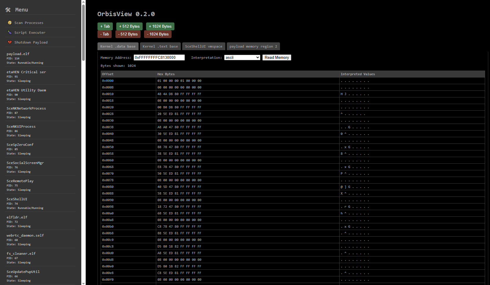

# **OrbisView - A PS5 reverse engineering tool for exploring data structures and memory layouts..**

# Works on every device that can run python!

# **Table of Contents**
1. **[Features](#framework-features)**
2. **[Download](#download)**
3. **[Requirements](#requirements)**
4. **[Setup & Build](#setup--build)**
5. **[Preview Videos](#preview-videos)**

## **Features**
Here are all the available features of OrbisView listed, explained and also planned features can be found here

-   **Research memory structures and data**
    * View data as ``uint8_t``, ``uint16_t``, ``uint32_t``, ``uint64_t``, ``hex64``, ``ascii``, ``float`` and ``int64_t``
    * Add dynamically more bytes to your active tab using the buttons ``+ 512 Bytes`` or ``1024 Bytes``
    * All ``0x100/256`` bytes are highlighted by an accentuated color
- **Scan processes running on your PS5**
    * Show all of your processes with more information about them (``pid``, ``state`` and more to follow)
    * Soon there will be the functionality to show also loaded memory regions for each process utilizing it's specific vmspace 

## **Download**
If you don't want to build the payload manually, just download the compiled one from the Release section!

TODO: Add Github Action for automatically CI/CD workflow.

## **Requirements**
1. Currently only tested on Firmware 2.00 but should work on all supported firmwares by the SDK.
    - There are maybe some limitiations forced by XOM (eXecute-Only-Memory) from your PS5, which memory region you are able to read
2. C++23 is the highest language revision of C++ used.
3. Relies on [Nihonium](https://github.com/cragson/nihonium), my own hacking framework for the PS5 and the SDK from [John Törnblom](https://github.com/john-tornblom), thanks for the great work!

## **Setup & Build**
1. Clone the repo **recursively**!
    - With HTTPS: ``git clone --recursively https://github.com/cragson/orbisview``
    - With SSH: ``git clone --recursively git@github.com:cragson/orbisview``
2. **Make sure your PS5 has already the ``elfldr`` running and is reachable from your network!**
3. Build the ``orbisview.elf`` payload by running the ``debug.sh``
    - Allow script execution: ``chmod +x debug.sh``
    - Execute build script: ``./debug.sh``
4. After running the build script it should compile the payload and send it automatically to your PS5, there should be now a notifictaion from OrbisView
5. Run now the Flask python server for your Webinterface
    - ``py orbisview.py``
6. Go now into your browser and navigate to ``http://localhost:5000``
    - **Done! Have fun.**

## **Preview Videos**

* **OrbisView 0.1.0**
    - 

* **OrbisView 0.0.1**
    - 